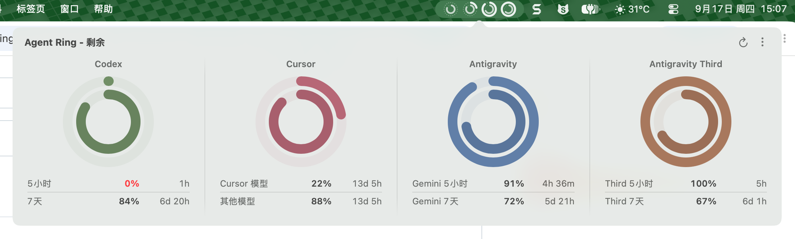
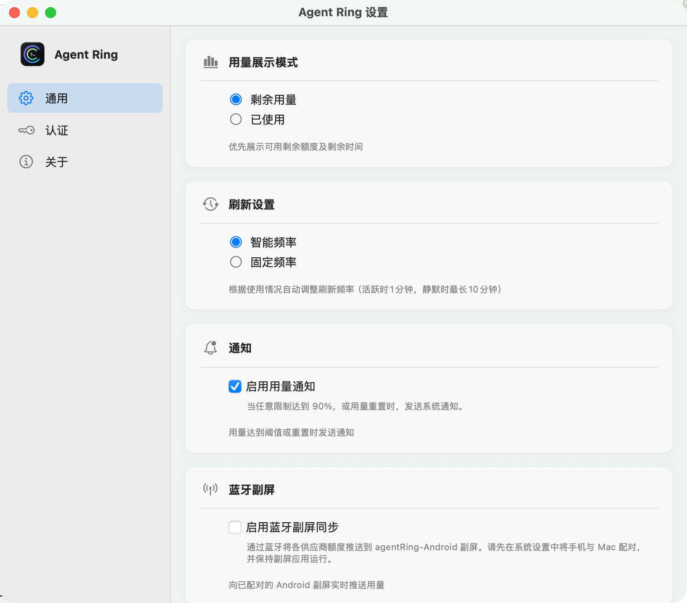
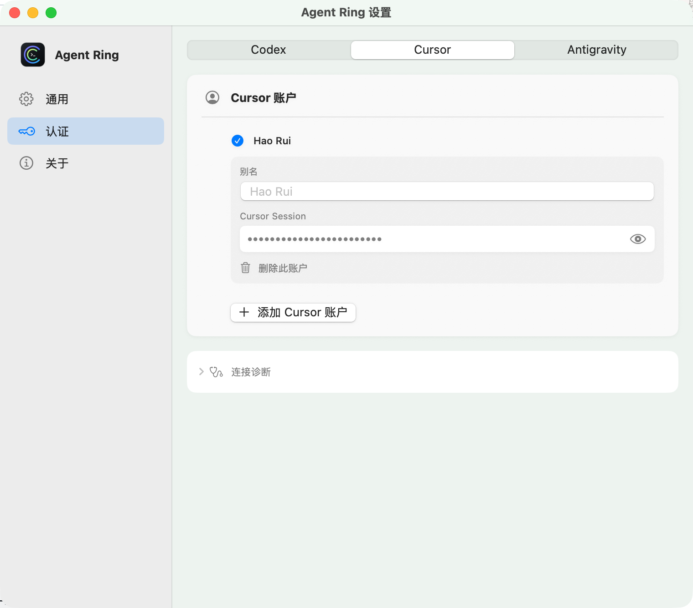

# Agent Ring

[English](README_EN.md) · 简体中文

<p align="center">
  
</p>

<p align="center">
  <strong>macOS 菜单栏上的 AI 用量环形监视器</strong><br />
  一眼看清 Codex、Cursor、Antigravity 还剩多少额度。
</p>

<p align="center">
  <a href="https://github.com/haorui-lab/agentRing/releases/latest"></a>
</p>

<p align="center">
  
  
  
  
</p>

<p align="center">
  
</p>

## 界面预览

| 通用设置 | 账户认证 |
| :---: | :---: |
|  |  |

## 下载

1. 打开 [Latest Release](https://github.com/haorui-lab/agentRing/releases/latest)
2. 下载 `AgentRing-*-macos.dmg`
3. 退出旧版，打开 DMG，将 `AgentRing.app` 拖入「应用程序」并选择替换
4. 若系统提示无法验证开发者，在「系统设置 → 隐私与安全性」中选择「仍要打开」

> 发布包使用 ad-hoc 应用签名，未经 Apple 公证。安装含 Sparkle 的版本后，应用内更新会验证 EdDSA 签名并自动安装重启；更早版本需要手动覆盖安装一次。

## 功能

- **AI 编程助手额度聚合监控**：菜单栏同屏圆环监视，当前支持：Codex、Cursor、Antigravity
- **原生设置质感**：侧边栏 + 分段认证页
- **跟随系统**：深浅色、时间格式；界面语言为简体中文 / English
- **多账户**：登录、切换、别名；Antigravity 使用本机凭证探测
- **智能刷新**：用量变化时加快，空闲时放慢
- **极简入口**：数据面板 `…` 直接进入设置
- **Android 桌面副屏联动**：通过经典蓝牙 SPP 将用量与倒计时实时推送到副屏（配合 [agentRing-Android](https://github.com/davidhoo/agentRing-Android) 在闲置手机或外接屏幕上常显）

## 副屏硬件生态

- **[agentRing-Android](https://github.com/davidhoo/agentRing-Android)**：基于 Agent Ring 蓝牙输出数据打造的 Android 桌面副屏应用。利用经典蓝牙 SPP 实时同步用量额度、双同心圆环与重置倒计时，专为工位闲置手机、桌面小屏幕打造。
- **通讯协议**：欢迎开发者适配更多硬件设备（如 ESP32、墨水屏摆件等），完整规范详见 [`docs/BLUETOOTH_PROTOCOL.md`](docs/BLUETOOTH_PROTOCOL.md)。

## 从源码构建

**要求**：macOS 13+、Xcode 15+

```bash
git clone https://github.com/haorui-lab/agentRing.git
cd agentRing
open AgentRing.xcodeproj
```

在 Xcode 中选择 scheme **AgentRing**，按 `⌘R` 运行。应用图标将出现在菜单栏。

命令行构建：

```bash
xcodebuild -project AgentRing.xcodeproj -scheme AgentRing \
  -configuration Debug -derivedDataPath ./build-temp build \
  && open ./build-temp/Build/Products/Debug/AgentRing.app
```

## 系统要求

- macOS 13.0+
- Apple Silicon 或 Intel

## 开源协议

[MIT License](LICENSE)

基于 [f-is-h/Usage4Claude](https://github.com/f-is-h/Usage4Claude) 分支演进，致谢上游作者。

## 说明

- Bundle ID 为 `app.agentring.AgentRing`；首次升级会从旧 ID `app.agentsring.AgentsRing` 迁移钥匙串与偏好设置。对外显示名为 **Agent Ring**。
- 维护者发布流程见 [`docs/RELEASING.md`](docs/RELEASING.md)。
- 更新签名密钥配置和迁移步骤见 [`docs/auto-update.md`](docs/auto-update.md)。
