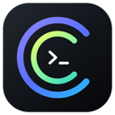

# Agent Ring

[English](README_EN.md) · 简体中文

<p align="center">
  
</p>

<p align="center">
  <strong>macOS 菜单栏上的 AI 用量环形监视器</strong><br />
  一眼看清 Codex、Cursor、Antigravity 还剩多少额度。
</p>

<p align="center">
  <a href="https://github.com/haorui-lab/agentRing/releases/latest"></a>
</p>

<p align="center">
  
  
  
  
</p>

正式名称：**Agent Ring** · 仓库：`agentRing` · 产物：`AgentRing.app`

## 下载（普通用户）

1. 打开 [Latest Release](https://github.com/haorui-lab/agentRing/releases/latest)
2. 下载 `AgentRing-*-macos.zip`
3. 解压，把 `AgentRing.app` 拖进「应用程序」
4. 若系统提示无法验证开发者：右键 App → **打开** → **仍要打开**

> 当前公开发布包是 ad-hoc 签名，**还没做 Apple 公证**。这不是偷懒文案，是现阶段真实状态。接上 Developer ID + 公证后，这一步会消失。

还没有 Release？先按下面「本地启动」用 Xcode 跑，或等打上 `v*` 标签后由 GitHub Actions 自动出包。

## 截图

| 菜单栏用量 | 通用设置 | 认证设置 |
| --- | --- | --- |
|  |  |  |

请把实拍图放到 [`docs/screenshots/`](docs/screenshots/README.md)，再替换上表链接。没有真图之前，这里只用 App 图标占位——**不会拿假界面糊弄人**。

## 功能亮点

- **三家额度一网打尽**：Codex / Cursor / Antigravity 同屏圆环
- **原生设置质感**：侧边栏 + 分段认证页，跟系统设置一个味儿
- **完全跟随系统**：深浅色、时间格式跟 macOS；语言仅简体中文 / English
- **多账号**：登录、切换、别名；Antigravity 走本机凭证探测
- **智能刷新**：用量在动就勤刷，闲下来就放慢
- **极简入口**：数据面板 `…` 直接进设置，不堆二级菜单

## 本地如何启动一个新的

### 方法 A：Xcode（推荐）

```bash
git clone https://github.com/haorui-lab/agentRing.git
cd agentRing
open AgentRing.xcodeproj
```

1. 上方 scheme 选 **AgentRing**
2. 按 `⌘R` 运行
3. 看菜单栏右侧出现圆环
4. 若已有旧进程在跑，先退出旧的，避免俩实例打架

### 方法 B：命令行

```bash
xcodebuild -project AgentRing.xcodeproj -scheme AgentRing \
  -configuration Debug -derivedDataPath ./build-temp build \
  && open ./build-temp/Build/Products/Debug/AgentRing.app
```

`build-temp/` 已被 `.gitignore` 忽略，别提交上去。

## 推到 GitHub 之后如何自动打包

仓库已带 GitHub Actions：

| 工作流 | 触发 | 干什么 |
| --- | --- | --- |
| [`.github/workflows/ci.yml`](.github/workflows/ci.yml) | push / PR 到 `main` | 云端编译，证明能过构建 |
| [`.github/workflows/release.yml`](.github/workflows/release.yml) | 推送 `v*` 标签 | 编译 Release → 打 zip → 挂到 Releases |

发版示例：

```bash
git tag v0.1.0
git push origin v0.1.0
```

然后到 Actions 看流水线，完成后去 [Releases](https://github.com/haorui-lab/agentRing/releases) 下载。

也可在 Actions 里手动跑 **Release** 工作流（`workflow_dispatch`）做试打包。

## 系统要求

- macOS 13.0+
- 开发构建：Xcode 15+（建议当前正式版）
- Apple Silicon 或 Intel

## 开源协议与致谢

[MIT License](LICENSE)

基于 [f-is-h/Usage4Claude](https://github.com/f-is-h/Usage4Claude) 分支演进，致谢上游作者。

## 说明

- Bundle ID 仍为 `app.agentsring.AgentsRing`，避免已有钥匙串账号失效；对外显示名始终是 **Agent Ring**。
- `build/`、DerivedData、本地工具目录不进仓库。
