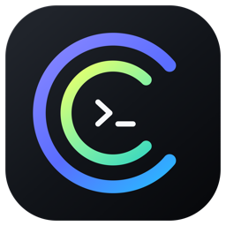

# Agent Ring

[简体中文](README.md) · English

<p align="center">
  
</p>

<p align="center">
  <strong>AI usage rings in your macOS menu bar</strong><br />
  See remaining Codex, Cursor, and Antigravity quota at a glance.
</p>

<p align="center">
  <a href="https://github.com/haorui-lab/agentRing/releases/latest"></a>
</p>

<p align="center">
  
  
  
  
</p>

## Download

1. Open [Latest Release](https://github.com/haorui-lab/agentRing/releases/latest)
2. Download `AgentRing-*-macos.dmg`
3. Quit the old version, open the DMG, and drag `AgentRing.app` into Applications, replacing the old copy
4. If macOS blocks it, use **System Settings → Privacy & Security → Open Anyway**

> Builds are ad-hoc signed and not Apple-notarized. Sparkle verifies in-app updates with EdDSA signatures before installing and restarting. Users of pre-Sparkle versions need one manual replacement installation.

## Features

- **AI usage aggregation**: glanceable menu bar rings; currently supports: Codex, Cursor, and Antigravity
- **Native settings feel**: sidebar + segmented auth
- **Follows the system**: appearance and clock; UI languages: Simplified Chinese / English
- **Multi-account**: login, switch, aliases; Antigravity uses local credential discovery
- **Smart refresh**: faster when usage moves, slower when idle
- **Short path**: popover `…` opens Settings directly

## Building from Source

**Requires**: macOS 13+, Xcode 15+

```bash
git clone https://github.com/haorui-lab/agentRing.git
cd agentRing
open AgentRing.xcodeproj
```

Select scheme **AgentRing**, press `⌘R`. The app icon appears in the menu bar.

CLI build:

```bash
xcodebuild -project AgentRing.xcodeproj -scheme AgentRing \
  -configuration Debug -derivedDataPath ./build-temp build \
  && open ./build-temp/Build/Products/Debug/AgentRing.app
```

## Requirements

- macOS 13.0+
- Apple Silicon or Intel

## License

[MIT](LICENSE). Forked from [f-is-h/Usage4Claude](https://github.com/f-is-h/Usage4Claude) — thanks to the upstream author.

## Notes

- Bundle ID is `app.agentring.AgentRing`. On first upgrade, credentials and preferences migrate from the legacy ID `app.agentsring.AgentsRing`. Display name is **Agent Ring**.
- Maintainer release process: [`docs/RELEASING.md`](docs/RELEASING.md).
- Update signing keys and migration: [`docs/auto-update.md`](docs/auto-update.md).
